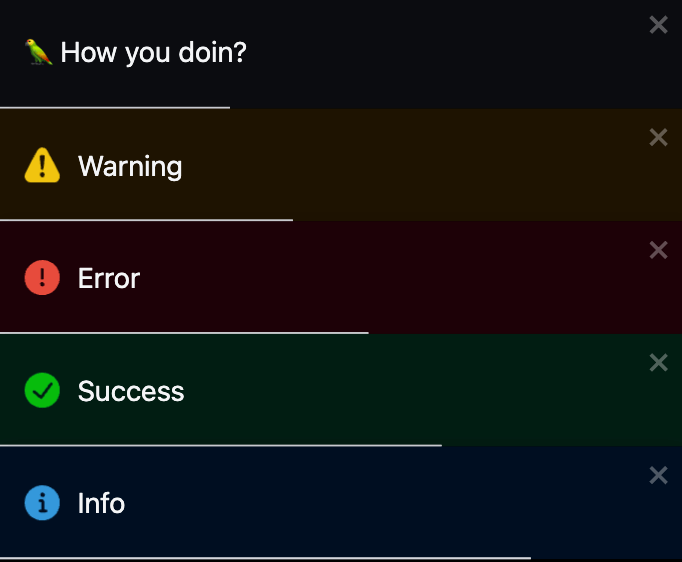

# React Toastify

This is an example of how to use and customize [React Toastify](https://www.npmjs.com/package/react-toastify)

## Demo

- [https://react-toastify.vercel.app/](https://react-toastify.vercel.app/)

#### Screenshot



## RUN APP

```bash
npm i
npm start
```
